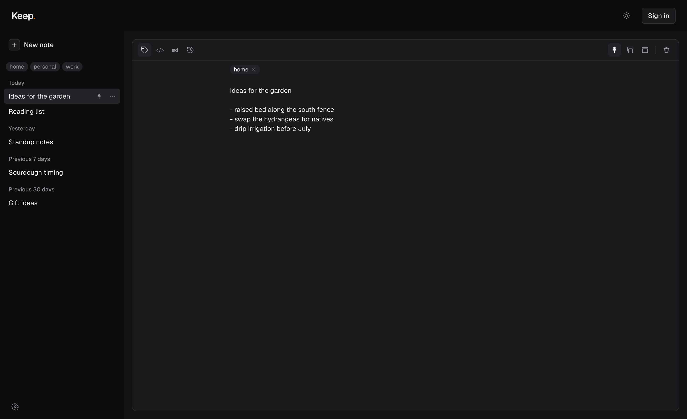

# Keep

A small, opinionated notes app — autosave, pin/archive/trash, full-text search across title and body, and a date-grouped ChatGPT-style sidebar. Built as a single-page Next.js app backed by Postgres, with a guest mode that stores notes in `localStorage` until you sign in.



## Stack

- **Next.js 14** (App Router, route handlers for the API)
- **TypeScript** end to end
- **Tailwind CSS** with CSS variables for the graphite & amber color tokens (dark + light)
- **NextAuth** for sign-in (guest mode works without auth)
- **Postgres** via `pg`, with a pooled client cached across hot reloads and a self-healing schema bootstrap

## Features

- Autosaving editor — no Save button; new notes persist as soon as you start typing
- LLM-generated note titles (falls back to local inference when no API key is set)
- Pin, archive, move-to-trash, restore, delete-forever
- Full-text search via a `⌘K` / `/` / `f` modal with `↑` `↓` and `Enter` navigation
- Date-grouped sidebar (Today / Yesterday / Previous 7 days / Previous 30 days / Older)
- Archive and Trash reachable from the Settings pane with a one-click "Back to notes"
- Guest mode: notes live in `localStorage`; signing in migrates them to your account
- Markdown preview and opt-in Shiki syntax highlighting per note
- Version history with line diffs and one-click restore
- Public share links (`/p/<token>`) with revocation
- Passkey sign-in alongside Google OAuth
- Google Keep Takeout import (Takeout ZIP or single `.json`)
- Plain-text export — single `.txt` per note, or a ZIP of everything
- Graceful DB-error banner with retry — the app stays usable even when Postgres is unreachable
- SSL-aware Postgres connection that works against both self-hosted (self-signed cert) and managed providers

## Getting started

```bash
# 1. Install
npm install

# 2. Point at a Postgres instance
cp .env.example .env.local
# edit DATABASE_URL (and OPENAI_API_KEY if you want LLM titles)

# 3. Run
npm run dev
```

The schema (one `notes` table + a few indexes) is created on first request — no separate migration step. Migrations are expressed idempotently in `lib/db.ts` so dropped columns and added indexes apply on next boot.

## Project layout

```
app/
  api/notes/         CRUD + import + export + title route handlers
  layout.tsx         Root layout
  page.tsx           Header + NotesView
  signin/            NextAuth sign-in page
components/
  Header.tsx         Top bar (wordmark + auth chip)
  NotesView.tsx      Sidebar, search overlay, settings pane, editor wiring
  NoteEditor.tsx     Autosaving editor (new + edit modes both autosave)
  Icons.tsx          Inline SVG icons
lib/
  db.ts              pg Pool + SSL handling + idempotent schema bootstrap
  types.ts           Note shape
  useNotes.ts        Client hook: fetch + optimistic mutations + guest sync
  inferTitle.ts      Local zero-token title fallback
  titleModel.ts      OpenAI-backed title generation
  googleKeepImport.ts  Takeout parser
auth.ts              NextAuth config
```

## Deployment

Deploys cleanly to Vercel. Set `DATABASE_URL` as a project environment variable. Set `OPENAI_API_KEY` to enable LLM-generated note titles; without it, Keep falls back to local zero-token title inference. Any Postgres provider works — the connection layer handles both managed (real CA) and self-hosted (self-signed) certs.

## License

MIT
