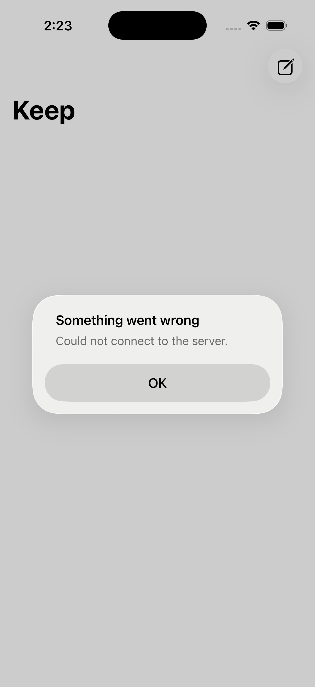
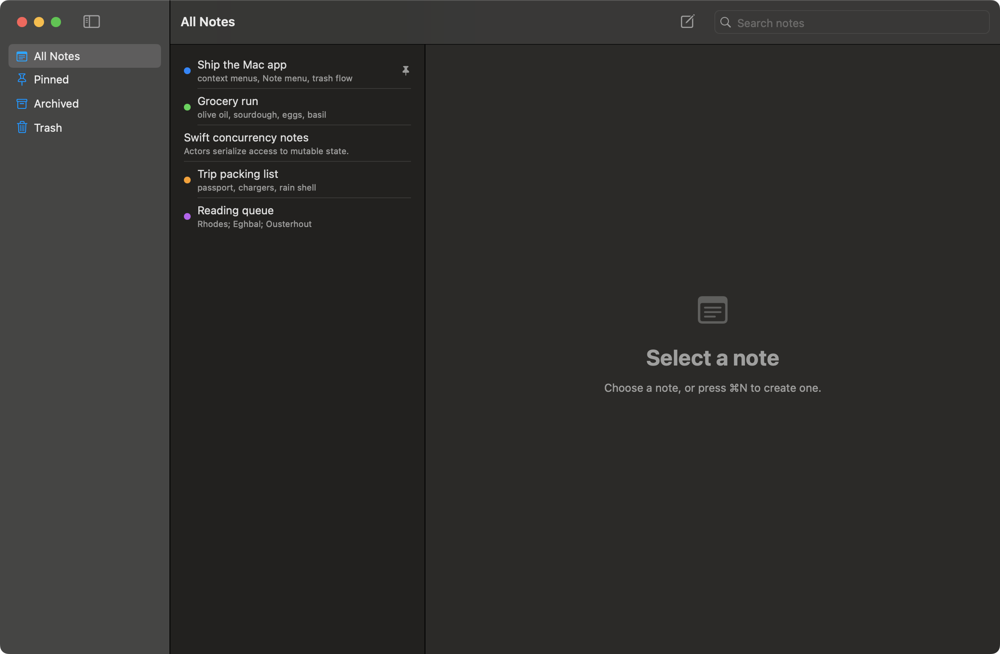

# Keep — iOS (SwiftUI)

A native SwiftUI client for the Keep web app, talking to the existing
Next.js API (`/api/notes`), with universal iPhone/iPad support and a separate
macOS app. Both clients share account-scoped durable drafts, conditional saves,
and recovery actions.



> The shot refreshes automatically on each merge to `main` (see Screenshots).
> Until signed in (or pointed at a reachable backend) it shows the sign-in state.

## Requirements

- Xcode 15+ (iOS 17 deployment target; uses the `@Observable` macro)
- [XcodeGen](https://github.com/yonaskolb/XcodeGen) to generate the project:
  `brew install xcodegen`

## Generate & run

```bash
cd ios
xcodegen generate      # produces Keep.xcodeproj from project.yml
open Keep.xcodeproj
```

Set the backend in `project.yml` → `KEEP_BASE_URL` (defaults to
`https://keeptxt.com` so the app works out of the box; flip to
`http://localhost:3000` for local dev). `Config.swift` reads it from the
Info.plist.

> Note: the loose `.swift` files show "cannot find type" in editors until the
> Xcode target exists — they only compile as a built target, not in isolation.

## Structure

```
Keep/
  KeepApp.swift            App entry; injects NotesStore
  Support/Config.swift     Base URL from Info.plist
  Models/Note.swift        Mirrors lib/types.ts Note
  Services/KeepAPI.swift   URLSession client over /api/notes
  Services/AuthClient.swift Native NextAuth sign-in (csrf + credentials)
  Services/GoogleSignIn.swift Google via ASWebAuthenticationSession + bridge
  Services/NotesStore.swift @Observable view-model (sorted pinned-first)
  Assets.xcassets          App icon (the web's blue note mark, full-bleed)
  Views/RootView.swift     NavigationStack + initial load
  Views/SignInView.swift   Native email/password sign-in sheet
  Views/NotesListView.swift Glass note grid, context actions, compose
  Views/NoteEditorView.swift Debounced autosave editor (new→edit bridge)
```

## Auth

Email/password sign-in is **native** (no web view): `AuthClient` posts to the
NextAuth endpoints (`/api/auth/csrf` → `/api/auth/callback/password`) and the
shared `URLSession` cookie jar carries the resulting session cookie to
`/api/notes`. A 401 flips `NotesStore.needsAuth`, which presents `SignInView`.

Against `http://localhost:3000`, the Info.plist allows local-network cleartext
(`NSAllowsLocalNetworking`); production over HTTPS needs no exception.

**Google** sign-in is native too, but bridges through the server because Google
forbids OAuth in an embedded web view. `GoogleSignIn` opens the system browser
via `ASWebAuthenticationSession` at `/native/google` (the same Google flow the
web uses); on success the server's `/native/bridge` mints a single-use code and
redirects to `keep://auth-callback?code=…`, which `GoogleSignIn` trades at
`/api/native/exchange` for the session cookie — landing it in the shared
`URLSession` jar so `/api/notes` is authenticated. (The `keep://` scheme needs no
Info.plist registration; the auth session claims it for the flow's duration.)

## macOS app

`KeepMac` is a separate, fully native macOS target (SwiftUI on AppKit, not
Catalyst) that reuses the iOS model/services layer — same API client, native
NextAuth sign-in, and Core Spotlight indexing. On top of that it does the
Mac things: a three-column split view, right-click context menus (pin,
archive, color label, trash / put back / delete permanently), and a menu-bar
Note menu (⇧⌘P pin, ⌃⌘A archive, ⌘⌫ move to trash).



```bash
cd ios
xcodegen generate
xcodebuild -scheme KeepMac build   # or pick the KeepMac scheme in Xcode
```

## Screenshots

`scripts/ios-screenshot.sh` builds the app, boots a simulator, launches it, and
captures a screenshot — the mobile analog of `scripts/screenshot.sh` for the web
app. It archives under `ios/screenshots/` and refreshes `ios/docs/screenshot.png`
(the image above).

```bash
scripts/ios-screenshot.sh            # first available iPhone simulator
IOS_SIM_NAME="iPhone 17 Pro" scripts/ios-screenshot.sh
```

On every merge to `main`, the `ios-screenshot` CI job re-captures, archives the
shot under `ios/screenshots/`, and commits the refreshed image. It runs on a
macOS runner, so it's gated behind a repo variable to avoid spending macOS
minutes until you opt in:

```bash
gh variable set IOS_SCREENSHOT --body true
```

## Saving and accessibility

Edits are journaled to per-account, per-backend files before network work.
A new note keeps the same ID across retries. Opening a note does not write it
back; body updates name the server version they were based on. A conflicting
remote edit is preserved and the local draft offers retry or save-as-copy.
Permanent deletion waits for pending saves and retires the draft.

The interface uses SwiftUI controls, including `ShareLink`. Reading settings
provide text size, line spacing, and line width. iPhone and iPad always edit raw
Markdown as plain text. From the moment a note opens, its Note color button opens
a compact grid of eight swatches and a no-color icon, with a ring around the
current selection. Options have 44-point touch targets and VoiceOver color names.
Color choices are stored with the draft and included in creation, retry, and recovery.
Notes appear in a two-column grid of neutral, translucent rounded cards. iOS 26
uses native interactive Liquid Glass on each card; earlier iOS versions use
regular material. Independent surfaces allow each card to be a visible zoom
transition source. A small swatch carries each note's color.
The default view omits the All Notes heading to leave more room for cards.
Each card shows its title and a short summary or body preview, with pin/share indicators.
Accessibility text sizes use one column and allow longer titles. Touch and hold a
card for note actions; VoiceOver exposes the same actions. Search, view filters,
pull-to-refresh, and pinned-first ordering apply to the grid.
Opening a note presents an editor modal over the grid. The close button returns
to the same grid, filter, and search; dismissing flushes pending edits.
Swipe-to-dismiss is disabled for both existing and new notes.
On iOS 18 and later, a tapped card expands into the editor with SwiftUI's native
zoom transition and returns to its source on dismissal. Reduce Motion, new notes,
Spotlight results, and earlier iOS versions use the standard sheet presentation.
The editor initializes its title and body from the current draft or saved note
before presentation so text layout is ready for the first frame of the expansion.
The editor uses a compact header with the editable title and close icon in one row.
iOS 26 uses SwiftUI's standard close-role button with a circular glass style.
The color swatch sits at the modal's bottom-right, above the keyboard when editing.
The writing area reserves space for this action; the modal has no export button.
The title uses 22-point semibold at the default text size; the body retains its
reading-size preference. Title and body text have approximately 30-point side insets.
Each action has a 44-point touch target.
Accessibility text sizes move the title below the close button to keep it readable.
New notes and Spotlight results use the same modal. Both fields are directly
editable. New notes focus the title first, and Return
moves into the blank body, without a placeholder. Both fields disable keyboard
autocorrection and suggestions. The ASCII-capable keyboard removes the empty
prediction strip; pasted Unicode text is preserved. Both inputs have no outlines;
the title and body share one neutral, translucent material surface inspired by
the grid cards. Its rounded surface fills the presentation without an inset rim;
the text and controls retain their positions. Dark mode matches the near-black
charcoal tone of the grid cards. The text keeps its comfortable side insets.
The writing area spans the available width. Edits autosave while typing, with no
Save or Done button; closing also flushes pending edits. Titles wrap, and the
editor uses the available width by default; the comfortable line-width setting
keeps text in a centered column on iPad. In landscape or
at accessibility text sizes, focusing the body temporarily hides the title to
leave room above the keyboard; the close button remains available. Routine save
status is hidden; save errors show recovery below the writing area, including in
compact mode. Explicit titles are included in durable drafts and recovery and
remain intact in the notes list. The color control shows only the current swatch
(a hollow circle when unset); VoiceOver still announces its name and selected color.
Export file in a note's context menu saves its current body
as UTF-8 text (`.txt`) or Markdown (`.md`) through the system file picker. The title
provides the filename; body text, whitespace, and Markdown syntax are preserved.
Export includes unsaved drafts and works without a network save. It is also
available for archived and trashed notes.
The Mac Markdown preview retains heading semantics and image alt text with
loading/retry states.
The editor has a Note body label, notes expose state and accessibility actions,
and save errors are announced. Platform services still use Apple frameworks
for authentication, clipboard, Spotlight, networking, and persistence.

## Verification

```bash
cd ios
xcodegen generate
xcodebuild -project Keep.xcodeproj -scheme KeepCoreTests \
  -destination 'platform=macOS' test
xcodebuild -project Keep.xcodeproj -scheme KeepMac \
  -destination 'platform=macOS' CODE_SIGNING_ALLOWED=NO build
xcodebuild -project Keep.xcodeproj -scheme Keep \
  -destination 'generic/platform=iOS Simulator' CODE_SIGNING_ALLOWED=NO build
```

The native CI workflow runs the shared model/service tests and builds both app
schemes. Simulator and Mac fixture checks cover save failure/recovery, stable
creation, reading settings, and Markdown images. Physical-device performance,
VoiceOver rotor interaction, Voice Control, and Switch Control still need hands-on
verification; accessibility metadata and simulator screenshots do not establish
complete assistive-technology coverage.

## Future work

- A full offline catalogue and broader synchronization beyond the draft journal.
- Native bulk import/export, image paste/upload, version history, and share extension.
- Optional read-aloud and richer accessibility preferences, with user testing.
